# PopularMovies

## Project Overview
PopularMovies is an app that gives you all you need to know about movies and TV shows and a lot more..

## Key Concepts
- RxJava
- Retrofit with Gson
- Conductor (Fragment navigation pattern)
- Firebase JobDispatcher
- TMDB api
- ContentProvider, SQLite Database
- Picasso, ButterKnife
- WebView
- Playing videos in app
- Playing videos on YouTube

## Screenshots

### Movies Categories:

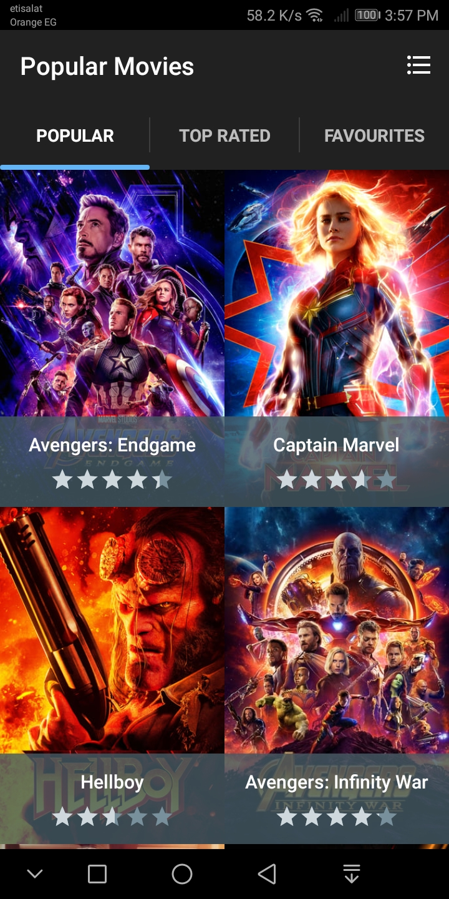

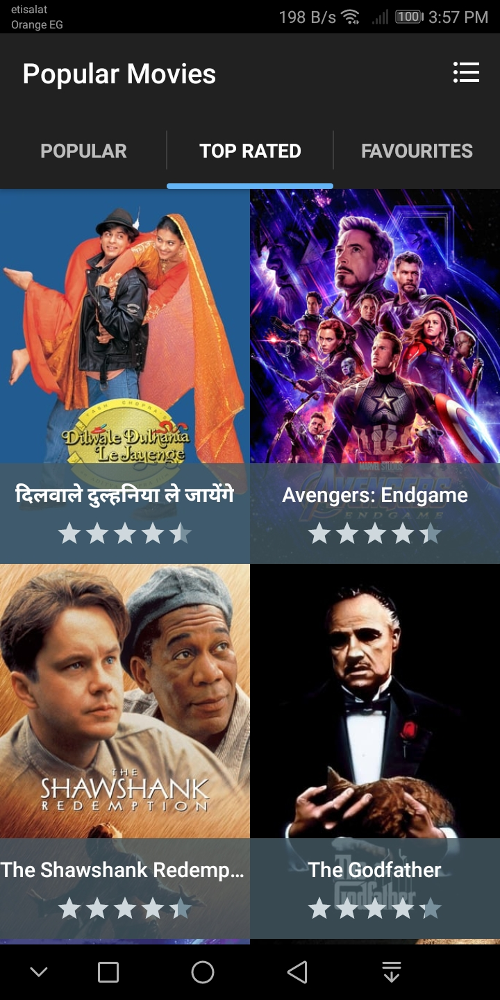

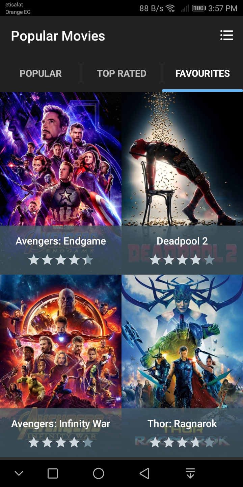

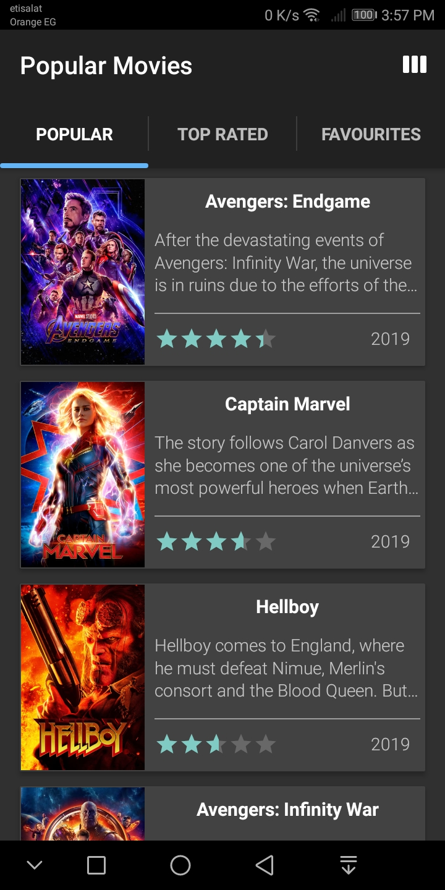

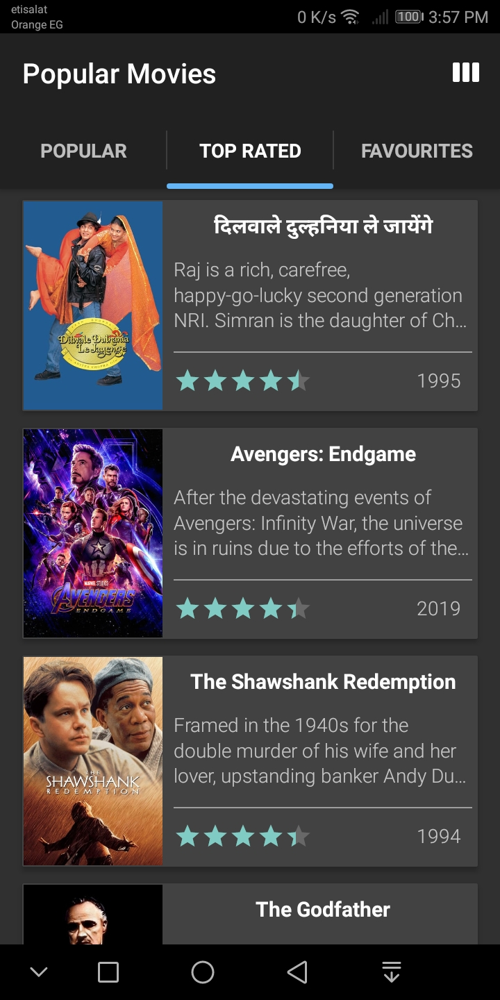

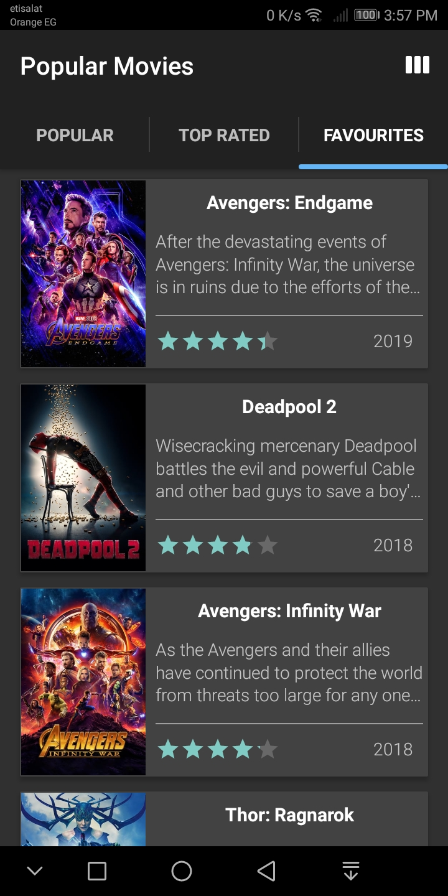

### Movie Details:

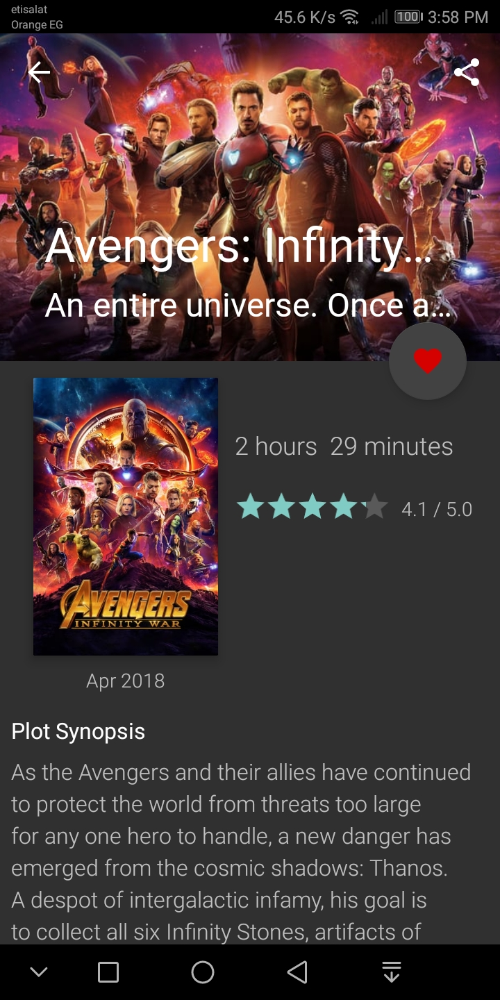

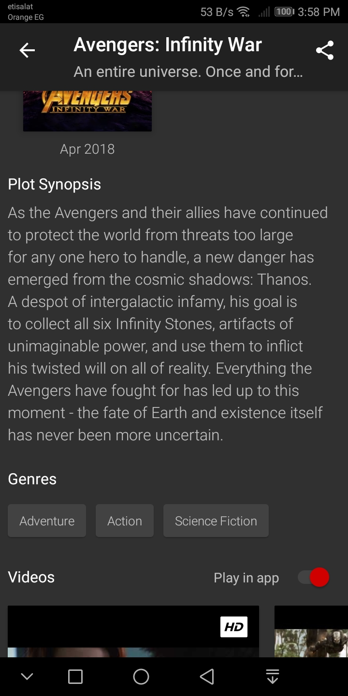

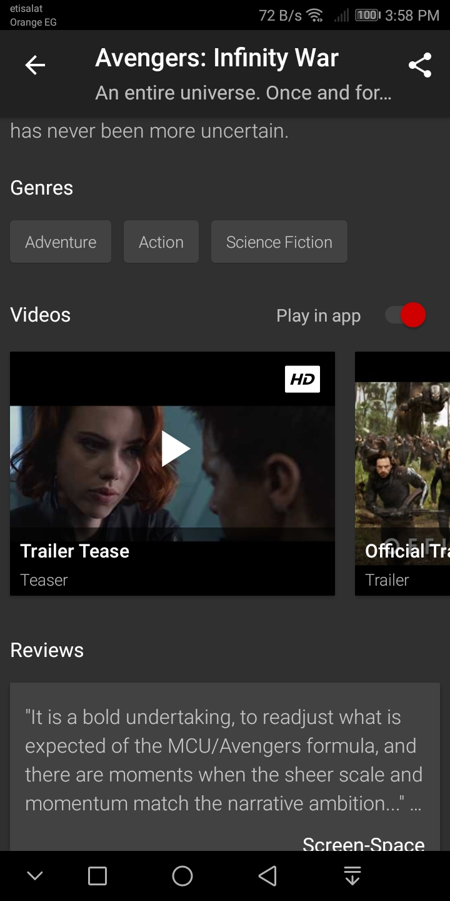

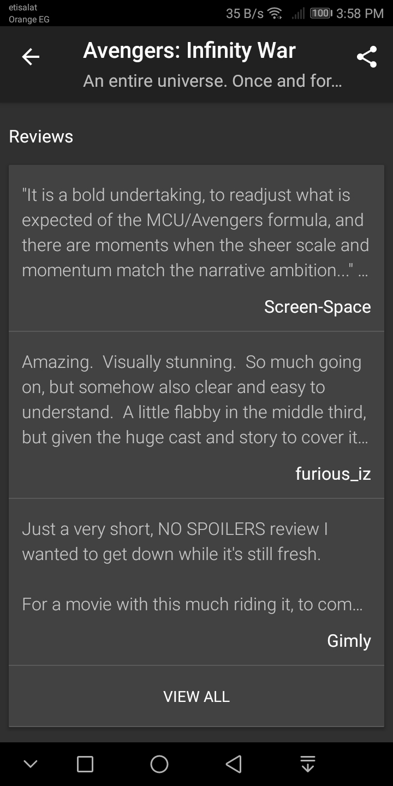

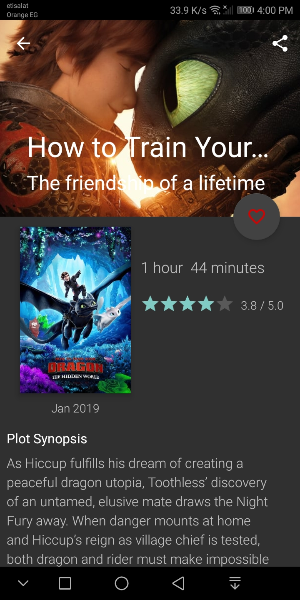

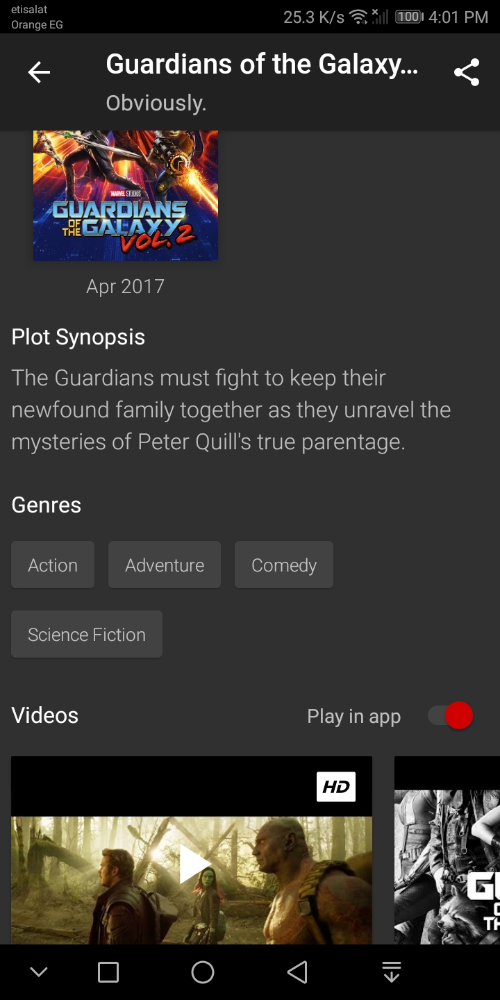

### Movie Trailers:

In app:

Via YouTube App:

### Movie Reviews:

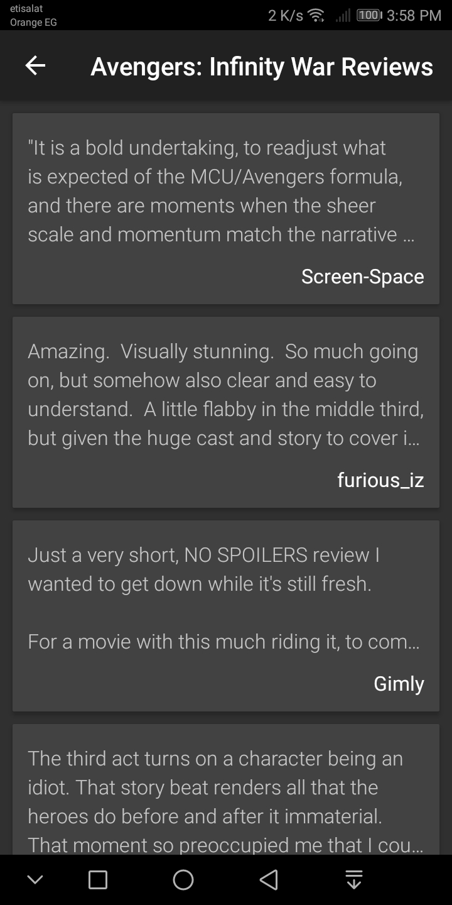

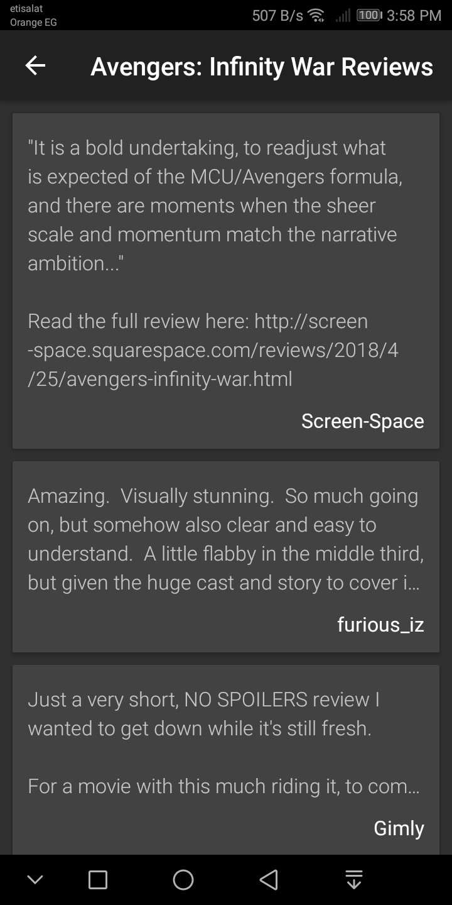

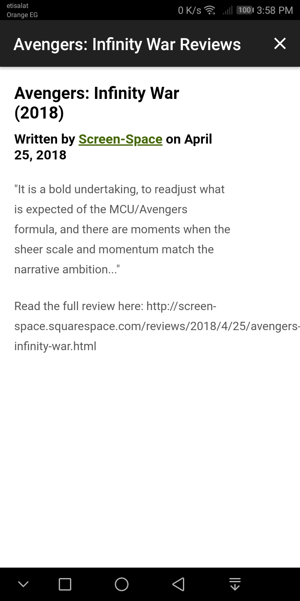

### Movie Sharing:

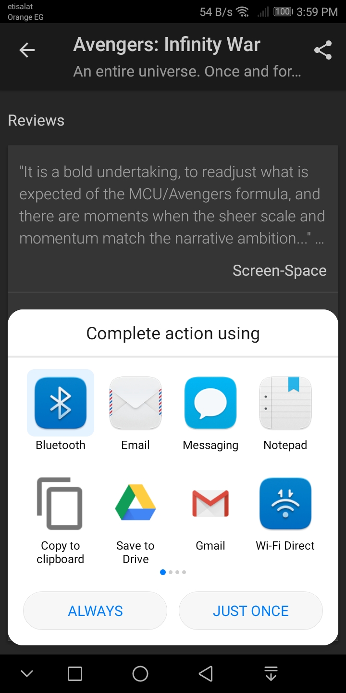

